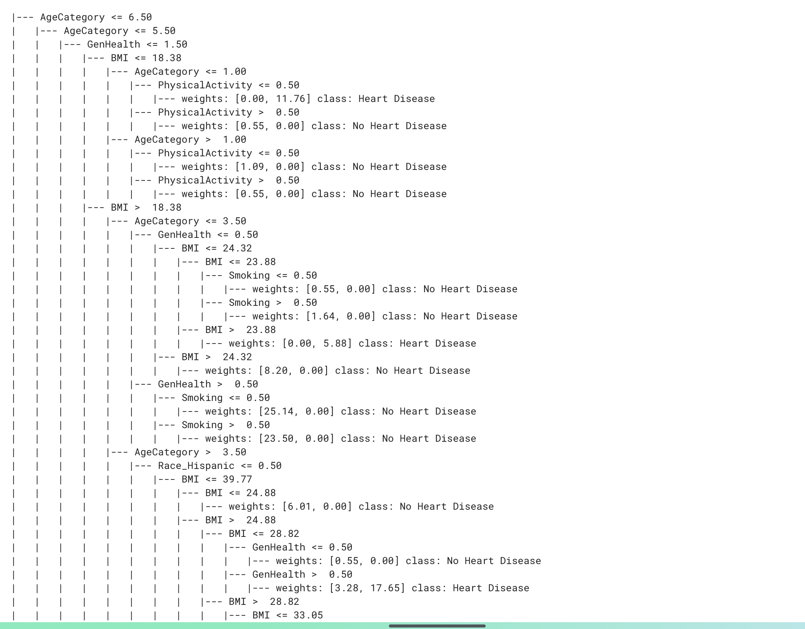

# Heart Disease Data Analysis

A data analysis and machine learning project using a dataset of health indicators to train a decision tree model.

## Demo

[View the project on Girls Who Code TextJam](https://hq.girlswhocode.com/TextJam/py/17952/bd5e51ec)

## How I Made It

- **Language:** Python
- **Libraries:** Pandas, scikit-learn, GWCutilities
- **Model:** Decision Tree
- **Dataset:** Indicators of Heart Disease

I used the GWC Pathways project instructions and starter code to clean the data and train a decision tree.

## What I Learned

- How to clean and encode data
- How to train a decision tree
- How to test a model using training and testing data
- How to interpret accuracy and confusion matrices

## What I Struggled With
I had trouble understanding how to prepare the different types of data for the machine learning model.
